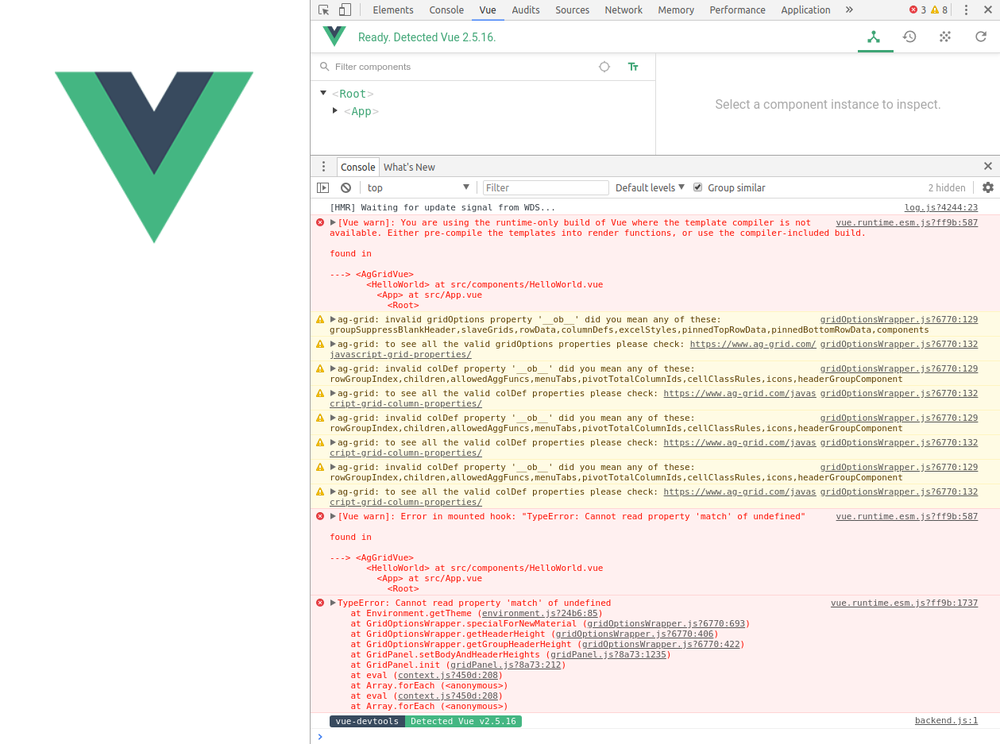

# Demo problem with [`ag-grid-vue`](https://www.ag-grid.com/best-vuejs-data-grid/)

[`ag-grid-vue`](https://www.ag-grid.com/best-vuejs-data-grid/) is no longer working with the vuejs application template.

Step to reproduce the problem

1) Create a new vuejs application with [vue-cli](https://github.com/vuejs/vue-cli)
```
vue create ag-grid-vue-test001
```
-> pick the `default preset (babel, eslint)`


2) Install ag-grid
```
cd ag-grid-vue-test001
npm install ag-grid
npm install ag-grid-vue
npm install ag-grid-enterprise
```

3) Try to use it in `src/components/HelloWorld.vue`
```
<template>
  <div>
    <ag-grid-vue :gridOptions="gridOptions"></ag-grid-vue>
  </div>
</template>

<script>
import { AgGridVue } from "ag-grid-vue";

export default {
  name: "HelloWorld",
  props: {
    msg: String
  },
  components: {
    "ag-grid-vue": AgGridVue
  },
  data() {
    return {
      gridOptions: {
        enableFilter: true,
        rowData: [
          { make: "Toyota", model: "Celica", price: 35000 },
          { make: "Ford", model: "Mondeo", price: 32000 },
          { make: "Porsche", model: "Boxter", price: 72000 }
        ],
        columnDefs: [
          { headerName: "Make", field: "make" },
          { headerName: "Model", field: "model" },
          { headerName: "Price", field: "price" }
        ]
      }
    };
  }
};
</script>
```


4) run it
```
npm run serve
```
and
